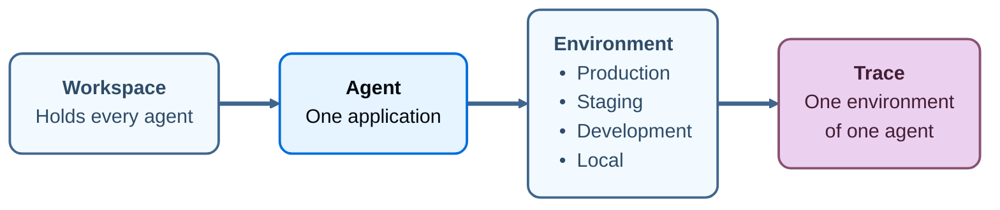

import AgentBetaNote from '/snippets/python/langsmith/agent-beta-note.mdx';

An _agent_ is a container for the traces, datasets, dashboards, and alerts of one application. Point your tracing at an agent once it exists, and everything that application records collects under it.

That one change removes a chore. Where a [tracing project](/langsmith/observability-concepts#tracing-projects) holds whatever you point at it, an agent states what the application is, and its [environments](/langsmith/agent-environments) state which deployment produced each trace. LangSmith can act on that: an alert watches production and stays quiet about local runs, a dashboard compares one agent across environments without a saved filter for each, and [Insights](/langsmith/insights) reads production traffic alone. You stop maintaining a naming convention to keep any of it straight.

<AgentBetaNote />

A workspace holds your agents, each agent's traces divide across [environments](/langsmith/agent-environments) drawn from a fixed set of four, and every trace belongs to one environment of one agent. Given a trace, the application that produced it and the deployment it ran on are both already known.

## Environments

An _environment_ records which deployment of an application produced a trace. The names are fixed: Production, Staging, Development, and Local.

For what the set contains, how to select one, and which parts of it are fixed, see [Agent environments](/langsmith/agent-environments).

## Identifiers and display names

Every agent has two names, and they do different work:

- **Identifier**: Set from the name you give the agent when you create it. Once set, it cannot be changed. LangSmith uses it to address traces, so it stays stable even when the display name changes. The tracing project behind each environment is the identifier, a hyphen, and the environment name, so an agent whose identifier is `checkout` has its production traces in `checkout-production`.
- **Display name**: Shown wherever the agent appears in the UI. Edit it at any time. Editing it does not move existing traces or change where new traces land.

The identifier is also what the browser address bar carries, so you can read it from there or copy it from the **ID** field on the agent's Overview.

{/*
  DOC-1597. The identifier is deliberately not called a slug, and no rule about case
  is stated, because the two create paths disagree and reconciling them is unowned.

  A paragraph here also said a third value appears, the UUID in the browser address
  bar. Screenshots dated 2026-09-20 show the address bar carrying the identifier, and
  no agent UUID anywhere in the UI. Do not restore it.

  Sources and ticket history are in DOC-1597.
*/}

## Why an agent rather than a project with environments

A tracing project holds whatever you point at it, so LangSmith can make no assumption about what is inside one. Two projects named `checkout-prod` and `checkout-staging` are unrelated containers as far as the platform is concerned, and keeping them related is a naming convention you maintain by hand.

An agent states what the application is, and an environment states which deployment of it produced a trace. That context is what lets LangSmith filter, compare, and alert on your behalf.

The tracing project has not gone away. `LANGSMITH_PROJECT` remains supported, and tracing projects remain in the API. See [Log traces to a specific project](/langsmith/log-traces-to-project).

## Next steps

<CardGroup cols={2}>

<Card
  title="Environments"
  cta="Learn more"
  href="/langsmith/agent-environments"
  icon="stack"
>
The deployments an agent's traces divide into, and the tracing project behind each one.
</Card>

<Card
  title="Navigate agents"
  cta="Learn more"
  href="/langsmith/navigate-agents"
  icon="compass"
>
The agent switcher, the agent list, the agent Overview, and where creation starts.
</Card>

<Card
  title="Log traces to an agent"
  cta="Learn more"
  href="/langsmith/log-traces-to-agent"
  icon="target"
>
How agent addressing sends traces to an agent and an environment, and why it cannot be combined with project addressing.
</Card>

<Card
  title="Observability concepts"
  cta="Learn more"
  href="/langsmith/observability-concepts"
  icon="book"
>
Runs, traces, threads, trace containers, and how LangSmith structures the data behind them.
</Card>

</CardGroup>

---

<Callout icon="terminal-2">
    [Connect these docs](/use-these-docs) to Claude, VSCode, and more via MCP for real-time answers.
</Callout>
<Callout icon="edit">
    [Edit this page on GitHub](https://github.com/langchain-ai/docs/edit/main/src/langsmith/agents.mdx) or [file an issue](https://github.com/langchain-ai/docs/issues/new/choose).
</Callout>

