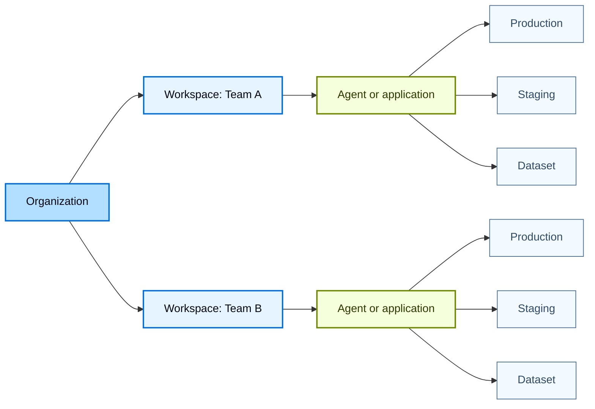
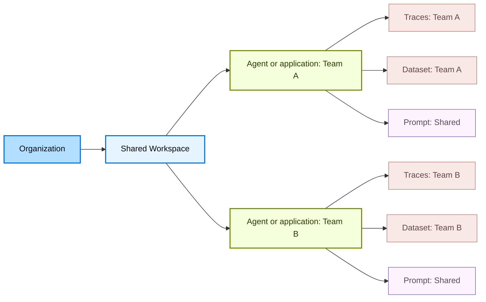
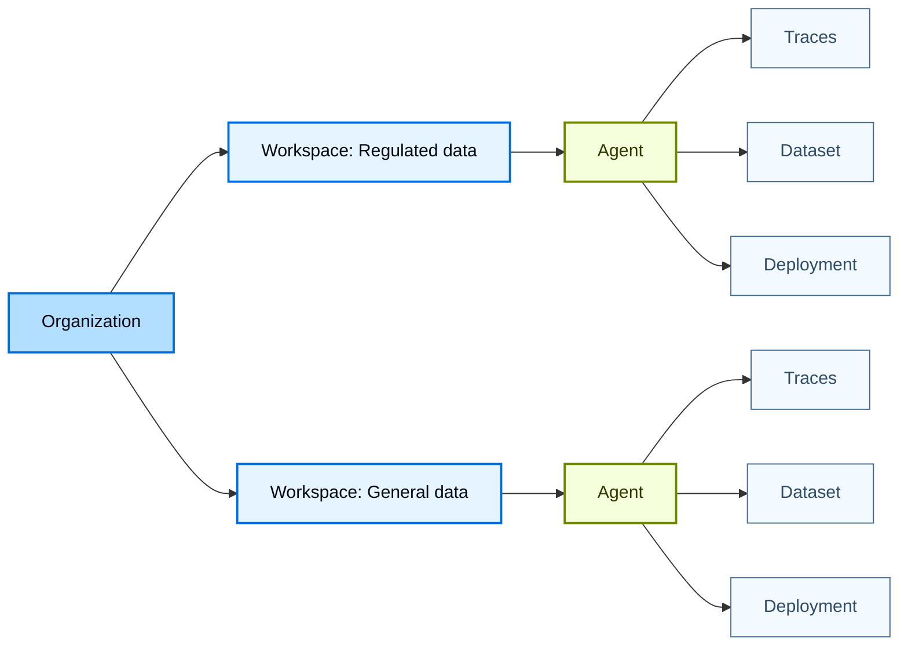

LangSmith uses a hierarchical structure to organize your work: [_organizations_](/langsmith/administration-overview#organizations), [_workspaces_](/langsmith/administration-overview#workspaces), [_agents or applications_](/langsmith/administration-overview#agents-and-applications), and [_resources_](/langsmith/administration-overview#resources). This structure lets you balance collaboration with access control, allowing you to choose the right level of isolation for your team's needs.

What the grouping level is called depends on which information architecture your workspace uses, and the control at the top left tells you which one you are on. An agent-based workspace groups resources by [agent](/langsmith/agents), and each agent's traces divide across [environments](/langsmith/agent-environments) drawn from a fixed set of four. A project-based workspace groups them by application instead, with no environment tier, so environments are approximated with separate tracing projects. Agent-based organization is in [beta](/langsmith/release-stages) for a private group of customers, so most workspaces are project-based. The models below apply to both, and the differences are called out where they matter.

The LangSmith permission system builds on this hierarchy. With [role-based access control (RBAC)](/langsmith/rbac), user [permissions](/langsmith/organization-workspace-operations) are scoped to one or more workspaces, enforcing isolation between workspaces. With more fine-grained [attribute-based access control](/langsmith/organization-workspace-operations#access-policies) (ABAC), access can be further restricted or granted based on attributes such as tags, agents, or applications within a workspace.

This page explains three common approaches to organizing workspaces based on your team's isolation requirements:

- [Team-centric workspaces](#team-centric-workspaces): Single workspace per team (recommended for most customers)
- [Collaborative workspaces](#collaborative-workspaces): Multiple teams per workspace
- [Strictly isolated workspaces](#strictly-isolated-workspaces): Multiple workspaces per team (for strict isolation requirements)

<Tip>
For details on setting up organizations and workspaces, refer to [Set up hierarchy](/langsmith/set-up-hierarchy).
</Tip>

## Team-centric workspaces

<Warning>
This is the default model and recommended choice for most customers.
</Warning>

This model (single workspace per team) uses a single organization as the top-level boundary. Within the organization, multiple workspaces are used to isolate different teams or business units. Each workspace represents a logical boundary for a specific team and governs which data and resources that team can access. Within a workspace, teams use multiple groups, agents or applications depending on the workspace, to collect the resources that support the same application.

In the diagram below, production and staging are an agent's environments in an agent-based workspace, and separate tracing projects in a project-based one.

- **Pros:** A single workspace allows all team resources to be shared, making collaboration and iteration within a team straightforward. It also simplifies promotion from development to production. For example, the same [prompt](/langsmith/prompt-context-hub#prompts) can be versioned and promoted to production using tags, without copying or duplication.
- **Cons:** Development, test, and production work coexists in one workspace, so workspace-scoped [RBAC](/langsmith/rbac) alone does not separate them. In an agent-based workspace, environments divide an agent's traces without any convention to maintain. In a project-based workspace, separation depends on tagging discipline. [ABAC](/langsmith/organization-workspace-operations#access-policies) provides more granular permissions within a workspace by restricting access based on resource attributes.

In a project-based workspace, teams commonly approximate environments with a naming convention, running paired projects such as `checkout-production` and `checkout-staging`. Agent environments replace that convention, so a workspace on the agent path does not need it.

## Collaborative workspaces

In this model (multiple teams per workspace), multiple teams share a single workspace within an organization and use agents or applications, together with [ABAC](/langsmith/organization-workspace-operations#access-policies), to separate resources and govern access. As a result, shared resources such as [prompts](/langsmith/prompt-context-hub#prompts) and [deployments](/langsmith/deployment) can be reused across teams, while access to sensitive resources like [traces](/langsmith/observability-concepts#traces) and [datasets](/langsmith/evaluation-concepts#datasets) is limited to the owning team.

- **Pros:** Common resources such as prompts and deployments can be shared and reused across teams, increasing collaboration and reducing duplicated work. Unlike the team-centric workspace model, collaboration is not limited to a single team and can span all teams within the workspace.
- **Cons:** Isolation between teams is weaker than in multi-workspace models and depends on correct use of ABAC. Misconfigured tags or policies can expose sensitive [traces](/langsmith/observability-concepts#traces) or [datasets](/langsmith/evaluation-concepts#datasets) across teams, and managing permissions across multiple teams adds operational complexity.

{/*
  DOC-1597. Anchor alias for the pre-2026-09 heading, which was
  '## Project-isolated workspaces'. The page URL did not change, so a
  docs.json redirect cannot help: Mintlify matches redirects on the path and a
  browser never sends the fragment to the server. An inbound deep link to the
  old anchor would otherwise land at the top of the page. No link inside src/
  uses it, so this is for external and in-product links only.
*/}

## Strictly isolated workspaces

<Callout icon="check" iconType="solid" color="#C7D2FE">
This approach should be used only when strict isolation is required.
</Callout>

In this model (multiple workspaces per team), isolation is increased by creating multiple workspaces for a single team, organized by the data boundary that has to hold. Each workspace is fully isolated, with its own users, data, and resources, and access is strictly scoped to that workspace. Use it when a regulatory, contractual, or customer boundary requires that one set of data be unreachable from another, not merely filtered out of view.

<Note>
Do not use this model to separate environments. A workspace per environment predates [agent environments](/langsmith/agent-environments), which divide an agent's traces inside a single workspace. Teams that adopted workspace-per-environment for that reason can consolidate into one workspace and gain parity across environments, without giving up the promotion path that separate workspaces block.
</Note>

- **Pros:** Strong isolation between teams, projects, and data boundaries. Users with access to one workspace cannot view or access another workspace's data or resources, reducing the risk of accidental changes or cross-boundary misuse.
- **Cons:** Resources cannot be shared across workspaces. Reusing [prompts](/langsmith/prompt-context-hub#prompts), [datasets](/langsmith/evaluation-concepts#datasets), or [experiments](/langsmith/evaluation-concepts#experiment) requires manual copying between workspaces, which introduces friction and duplication. To reduce this overhead, you can use the [LangSmith Data Migration Tool](https://github.com/langchain-ai/langsmith-data-migration-tool) to copy prompts, datasets, or experiments between workspaces.

---

<Callout icon="terminal-2">
    [Connect these docs](/use-these-docs) to Claude, VSCode, and more via MCP for real-time answers.
</Callout>
<Callout icon="edit">
    [Edit this page on GitHub](https://github.com/langchain-ai/docs/edit/main/src/langsmith/workload-isolation.mdx) or [file an issue](https://github.com/langchain-ai/docs/issues/new/choose).
</Callout>

